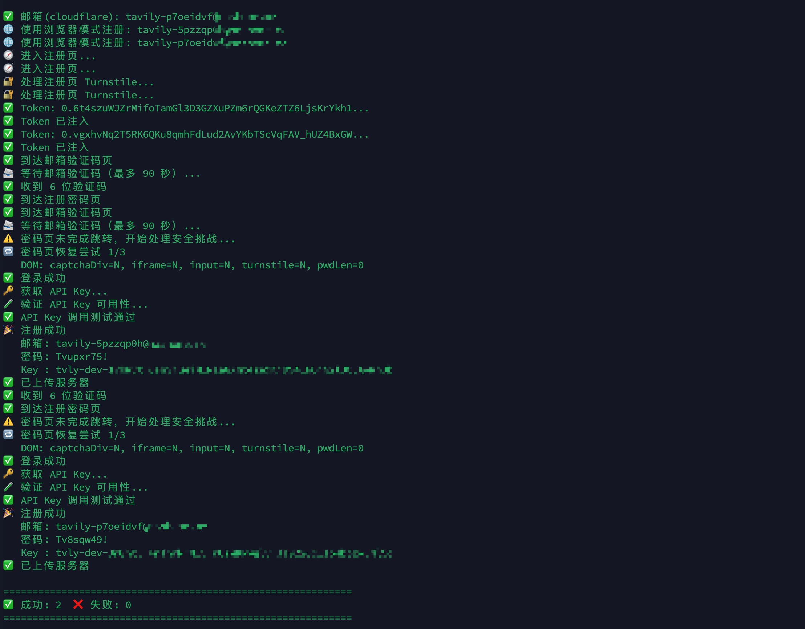

# API Key Generator - Multi-Service Edition

[中文说明](./README.md)

This is the current production-ready multi-service registration toolkit.
It puts **Tavily** and **Firecrawl** behind the same launcher:

- **Tavily**: AI search API
- **Firecrawl**: web scraping API

Unlike the older fragmented scripts, the current workflow is built around a
single stable pipeline:

- Real local browser registration
- Local Turnstile solver for Tavily
- Email API based verification-link / code retrieval
- Real API validation immediately after a key is extracted
- Optional automatic upload to the multi-service proxy pool

The goal is straightforward: keep Tavily / Firecrawl registration, validation,
output, and upload inside one workflow that can actually be reused long term.

For a general Cloudflare unlimited-alias domain mail guide, see:
[Cloudflare Mail Setup Guide](./docs/Cloudflare-Mail-Setup-Guide.md)

For the Chinese version of that guide, see:
[Cloudflare Mail Setup Guide (Chinese)](./docs/Cloudflare%E9%82%AE%E4%BB%B6%E8%AE%BE%E7%BD%AE%E8%AF%A6%E8%A7%A3.md)

## Features

- Multi-service launcher: choose Tavily or Firecrawl at startup
- Automatic environment bootstrap: checks `venv`, dependencies, and browsers
- Unified mail layer: supports Cloudflare Mail API and DuckMail
- Multi-domain support: choose the active domain at runtime
- Concurrent registration: batch and parallel runs are supported
- Background browser mode: headless by default, visible mode when debugging
- Real usability verification: validates the key against the official API
- Automatic upload to proxy pools: uploads include the service field, so the
  server can place Tavily and Firecrawl keys into the correct pools
- Proxy console: separate key pools, token pools, and real quota sync
- Cross-platform startup: Windows, macOS, and Linux

## Screenshots

### Multi-Service Launcher


### Concurrent Registration and Real API Validation



### Proxy Workspace Switcher


### Proxy Key Pool Details


## Quick Start

### 1. Clone

```bash
git clone https://github.com/skernelx/tavily-key-generator.git
cd tavily-key-generator
```

### 2. Configure

```bash
cp .env.example .env
```

Edit `.env` and fill in your mail configuration and optional upload settings.

### 3. Run

macOS / Linux:

```bash
python3 run.py
```

or:

```bash
./start_auto.sh
```

Windows:

```bat
start_auto.bat
```

## How It Works

When you run the launcher, it will automatically:

1. Choose the target service: Tavily or Firecrawl
2. Create or reuse `venv`
3. Install Python dependencies
4. Install Camoufox / Playwright browser dependencies
5. Load `.env`
6. Validate the configured mail provider
7. Let you choose the active domain if multiple domains are configured
8. Ask for the registration count
9. Ask for the concurrency level
10. Ask whether to upload results automatically
11. Start the local solver for Tavily
12. Handle email verification and password setup
13. Recover from random challenge cases on the Tavily password page
14. Extract the API key
15. Validate the key with a real API request
16. Save results to `accounts.txt` or `firecrawl_accounts.txt`
17. Upload results to the server when enabled

## Runtime Flow

```text
run.py
  -> choose service (Tavily / Firecrawl)
  -> load .env
  -> choose domain
  -> input count / concurrency
  -> choose upload or not
  -> [Tavily only] start Turnstile solver
  -> create mailbox
  -> open signup page
  -> [Tavily only] solve Turnstile locally
  -> receive email verification link
  -> set password
  -> [Tavily only] recover random password-page challenge
  -> enter dashboard
  -> extract API key
  -> verify API key with real API call
  -> save / upload
```

## Configuration

See [`.env.example`](./.env.example) for the full configuration template.

### Cloudflare Mail API

```env
EMAIL_PROVIDER=cloudflare
EMAIL_API_URL=https://your-mail-api.example.com
EMAIL_API_TOKEN=replace-with-your-token
EMAIL_DOMAIN=example.com
EMAIL_DOMAINS=example.com,example.org
```

Notes:

- Use `EMAIL_DOMAIN` for a single domain
- Use `EMAIL_DOMAINS` for multiple domains
- The launcher lets you choose the active domain at runtime

### DuckMail API

```env
EMAIL_PROVIDER=duckmail
DUCKMAIL_API_URL=https://api.duckmail.sbs
DUCKMAIL_API_KEY=
DUCKMAIL_DOMAIN=
DUCKMAIL_DOMAINS=
```

Notes:

- You can configure either one domain or multiple domains
- If you have a private DuckMail domain and API key, just put them in `.env`
- Public DuckMail domains can be used to test the mail path, but they are not
  guaranteed to pass Tavily risk control

### Upload to Your Server

```env
SERVER_URL=https://your-server.example.com
SERVER_ADMIN_PASSWORD=replace-with-your-admin-password
DEFAULT_UPLOAD=true
```

Notes:

- `DEFAULT_UPLOAD=true` makes upload enabled by default in the launcher
- The actual upload decision still depends on the runtime choice you make
- Upload payloads include the `service` field
- Tavily keys are automatically placed into the Tavily pool
- Firecrawl keys are automatically placed into the Firecrawl pool

### Runtime Options

```env
DEFAULT_COUNT=1
DEFAULT_CONCURRENCY=2
DEFAULT_DELAY=10
REGISTER_HEADLESS=true
FIRECRAWL_REGISTER_HEADLESS=true
EMAIL_CODE_TIMEOUT=90
API_KEY_TIMEOUT=20
EMAIL_POLL_INTERVAL=3
SOLVER_PORT=5073
SOLVER_THREADS=1
```

Notes:

- `REGISTER_HEADLESS=true` keeps the browser in the background
- `FIRECRAWL_REGISTER_HEADLESS` inherits `REGISTER_HEADLESS` if it is not set
- If you hit `Security check failed`, temporarily switch headless off and debug
  with a visible browser
- The effective solver thread count becomes `max(SOLVER_THREADS, concurrency)`
- In normal use, no extra command-line flags are needed

## Output

Successful registrations are written to:

**Tavily**:

```text
accounts.txt
```

**Firecrawl**:

```text
firecrawl_accounts.txt
```

Format:

```text
email,password,api_key
email,password,api_key
```

## Real-World Validation

The current mainline has been validated in real runs.

**Tavily**:

- Full registration works with the Cloudflare mail flow
- Email verification codes can be fetched automatically
- Extracted API keys are immediately validated with real API requests
- Concurrent registration has been regression tested
- Random password-page challenge recovery has been added and verified

**Firecrawl**:

- Email verification links can be fetched automatically
- Automatic sign-in and API key extraction are supported
- API key validation is done with real Firecrawl API requests
- Uploads to the proxy server are auto-tagged with `service=firecrawl`

## Known Limitations

### DuckMail Public Domains

The current status of public DuckMail domains is:

- Mailbox creation works
- 6-digit verification-code retrieval works
- Tavily may still be blocked on the password page

Common page message:

```text
Suspicious activity detected
```

If you want reliable full registration, prefer:

- Cloudflare custom-domain mail
- DuckMail private domain plus API key

### First Run on a New Machine

On a new machine, it is better to run one account first before enabling
concurrency.

The first run may need to download browser dependencies, and system, network,
or proxy conditions can differ across machines.

### System-Level Prerequisites

The launcher can bootstrap project dependencies and browser dependencies
automatically, but it does not install Python itself.

At minimum, the target machine should already have:

- Python 3
- `venv` support
- A usable network environment for installing dependencies

## Project Structure

```text
.
├── run.py                       # Recommended entry point
├── tavily_core.py               # Tavily registration entry
├── tavily_browser_solver.py     # Tavily browser registration flow
├── firecrawl_core.py            # Firecrawl registration entry
├── firecrawl_browser_solver.py  # Firecrawl browser registration flow
├── api_solver.py                # Local Turnstile solver (Tavily only)
├── mail_provider.py             # Mail provider abstraction
├── config.py                    # .env / environment loading
├── start_auto.sh                # macOS / Linux launcher
├── start_auto.bat               # Windows launcher
├── proxy/                       # Optional multi-service proxy
└── README.md
```

## Module Notes

Some files are not primary entry points, but they are still part of the
runtime:

- `tavily_core.py`
  Compatibility layer that forwards the unified entry to the Tavily browser
  flow.

- `browser_configs.py`
  Browser configuration helper used by `api_solver.py`.

- `db_results.py`
  Result-storage helper used by `api_solver.py`.

- `proxy/`
  Optional standalone module for turning Tavily / Firecrawl keys into separate
  pooled proxy services.

## Optional Proxy Service

If you want to route registered keys behind one stable endpoint, use `proxy/`.
It now exposes independent Tavily and Firecrawl pools, tokens, and quota sync.

Start it with:

```bash
cd proxy
docker compose up -d
```

See [`proxy/README.md`](./proxy/README.md) for details.

## Recommended Usage

If your goal is simply to batch-register and collect keys, the shortest path
is:

1. Configure `.env`
2. Run `python3 run.py`
3. Choose the service: Tavily or Firecrawl
4. Choose the mail domain
5. Enter the registration count
6. Enter the concurrency level
7. Read the results from `accounts.txt` or `firecrawl_accounts.txt`

If you also need centralized distribution, enable server upload or connect the
generated keys to `proxy/`.

## Disclaimer

This project is provided for automation testing, research, and personal
learning purposes only.

You are responsible for evaluating the target service terms, risk controls,
and account-usage implications.
